<!--
SETUP (delete this comment before publishing):
1. Create a repo named exactly `vivek1rajawat` (must match your username) if you don't have it yet —
   that's the one GitHub renders on your profile page. Keep it Public.
2. Copy this whole folder structure into that repo:
     README.md
     assets/banner.svg
     assets/stack.svg
     assets/divider.svg
     assets/contrib-space-shooter.svg
     assets/stats-panel.svg
     assets/resume.pdf
     scripts/generate-space-shooter.mjs
     scripts/generate-stats.mjs
     scripts/lib/contributions.mjs
     scripts/lib/palette.mjs
     .github/workflows/profile-widgets.yml
3. Push to `main`, then go to Actions -> "Update Profile Widgets" -> Run workflow, once, so it
   commits freshly-generated assets/contrib-space-shooter.svg and assets/stats-panel.svg from your
   real GitHub data. After that both refresh nightly on their own.
4. Everything else in this README (the typing line, icon row, view counter, footer wave) is a
   live badge from a public service — no setup, no files, it just works once the repo is public,
   and it always shows real numbers because it's computed fresh on every page load.
5. GitHub's "pinned repositories" row is a profile setting, not something a README can control.
   On your profile page, click "Customize your pins" and pin FocusOS first — it's your flagship
   project and currently isn't pinned at all.
-->

 

 

Final-year BE (ECE) student at Cambridge Institute of Technology, graduating 2027, targeting MERN Full-Stack Developer roles. I've shipped four independently deployed full-stack apps spanning AI agents, real-time systems, and cloud infrastructure — most recently **FocusOS**, a productivity platform with an autonomous LLM agent that performs real function-calling over live task and goal data, not a scripted demo.

I build end-to-end across the MERN stack — React front-ends, Node/Express/MongoDB back-ends, Docker containers, and multi-cloud deployment across Vercel, Render, and AWS ECS. Currently deepening data structures & algorithms and distributed-systems fundamentals ahead of technical interviews.

### Flagship project

<table>
<tr><td width="30%" valign="top"><h3>FocusOS</h3><em>Full-stack MERN · Live demo</em></td>
<td width="70%">

An AI-powered productivity platform unifying Kanban task management, goal tracking, notes, calendar, and analytics behind JWT-authenticated sessions. At its core is **KAI**, an autonomous agent (Groq / Llama 3.3 70B, with automatic fallback) that manages real tasks and goals via LLM function-calling — every write is grounded in live database IDs, so it can't hallucinate an action on data that doesn't exist. Ships a drag-and-drop Kanban board, a Recharts analytics dashboard, and native PDF export; client on Vercel, API on Render.

**[View repo →](https://github.com/vivek1rajawat/FocusOS)**

</td></tr>
</table>

### Stack

 

<b>Full skill list</b>

 

**Languages & Frontend** — JavaScript (ES6+), React.js, Redux Toolkit, TanStack Query, React Router, Tailwind CSS, Framer Motion, HTML5, CSS3

**Backend & APIs** — Node.js, Express.js, REST API design, JWT authentication, Socket.io (WebSockets), bcrypt

**Database** — MongoDB, Mongoose

**DevOps & Cloud** — Docker, AWS ECS, Elastic Load Balancer, GitHub Actions (CI/CD), Vercel, Render

**GenAI** — OpenAI-compatible API integration, prompt engineering, LLM function-calling & agentic tool use, LangChain basics, RAG pipelines

**Core CS** — Data structures & algorithms, object-oriented programming, DBMS

**Currently learning** — Redis, MySQL, system design (load balancing, caching strategies, microservice patterns), AWS EC2 / S3 / Lambda

### Other builds

| | |
|---|---|
| **[Resume Analyzer AI](https://github.com/vivek1rajawat/resumeAi)** | Full-stack + OpenAI API. A 4-stage pipeline (input → backend API → AI response parsing → structured UI output) turning raw resume text into role-specific feedback, tailored interview questions, and a rewritten draft — secured with JWT and backed by a reusable Tailwind component library with full loading/error-state handling. |
| **[Crypto Tracker](https://github.com/vivek1rajawat/Crypto-Project)** | React. Streams live price and market data for 200+ assets from a public REST API, with a fetch layer built to handle continuous updates without blocking the UI or shifting layout. Chart.js visualizations plus a searchable, filterable UI. |
| **[Eatify](https://github.com/vivek1rajawat/eatify)** | React + Tailwind CSS. A responsive food-delivery front-end with category-filtered menu browsing, cart management, and one reusable product-card/layout system applied without exception across every page. |

### Vital statistics

  

**Education** — BE, Electronics & Communication Engineering, Cambridge Institute of Technology, Bengaluru · CGPA 7.93/10 · Expected 2027

Off-keyboard, I play competitive chess — college tournament champion (#1) with All-India level experience.

 
<a href="https://portfolio-five-ashy-29.vercel.app/">Portfolio</a> &nbsp;·&nbsp;
<a href="https://www.linkedin.com/in/vivek-singh-rajawat-38664028a/?skipRedirect=true">LinkedIn</a> &nbsp;·&nbsp;
<a href="assets/resume.pdf">Resume</a> &nbsp;·&nbsp;
<a href="mailto:vivekrajawat2005@gmail.com">Email</a>

